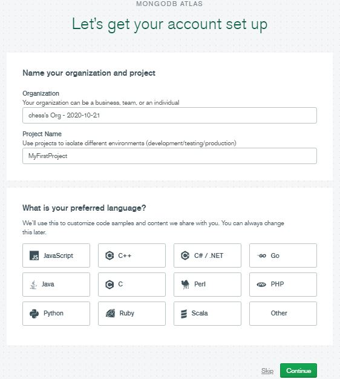
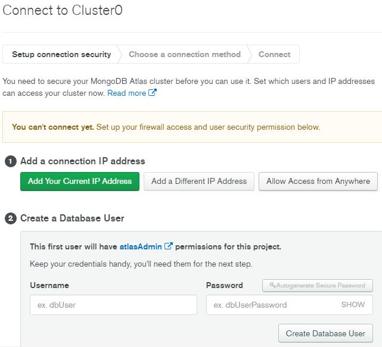
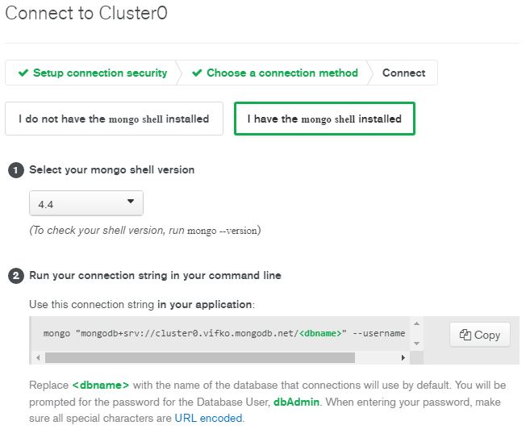

## What is MongoDb ##
Doing this microbyte means that you are somewhat familiar with database and tradition relational database management systems, most of which uses SQL to manage the database. But probably you are not much familiar with noSQL database. Yes they exist and have established themselves as worthy solutions to database management these days. Some say "noSQL" stands for "non SQL" while others say it stands for "not only SQL". Either way, noSQL databases are databases that store data in formats **other** than relational tables. Formats may vary from documents to key-value to graph. MongoDB is such a nonSQL DBMS solution. It is document-oriented and uses JSON like documents to store data with optional schemas.

<details>
    <summary>Curious cat:</summary>

    1. Does it mean that noSQL or non relational databases don't store relationship data well? This topic is very important but out of scope of this microbyte. So feel free to explore it yourself to kill your curosity. 
    2. Well, what is optional schema? You will get the answer to this question as you proceed through.
 
</details>

## Running MongoDB ##
What does it mean by running MongoDB? See MongoDB is a DBMS and DBMS is nothing but a software application. So before starting to use MongoDB we have to run the application first. There are basically two ways of running the MongoDB server application. You can either run it locally or remotely.

**Steps to run it locally**
1. Head over to the [official download page](https://www.mongodb.com/try/download/enterprise) and download the binaries according to your operating system of choice. Recomended to download the stable version.
2. Extract the archive(wherever you want).
3. For Windows users add the address of bin folder to your system variables' path variable. For MAC and Linux the procedure will be similar.  
4. Once installed run ```mongod``` in your command prompt or terminal. This will setup and run the MongoDB server application on your local machine (The default port is 27017).
5. On a different terminal run the command ```mongo``` to run mongo shell. If your MongoDB server is up and running, your mongo shell will automatically connect to it. Try entering ```db.version()``` for ensuring everything is working as it should. Hopefully you will see the version number you installed.

**Steps to run remotely**
1. Head over to [this link](https://account.mongodb.com/account/login) and create your account with an email id and password.

2. After creating your account you will see the below screen.<br>
<br>
You can leave them as default or skip it for now. However they are important when you are developing software for an enterprise.

3. Next you will be prompted the screen below. Select **Create a cluster** with the FREE option.<br>


4. Subsequently select AWS as the cloud provider, region as Mumbai(ap-south-1) and cluster tier as M0 Sandbox. Select **Create Cluster**.<br>


5. You will be redirected to the clusters page. It takes around two minutes to create your cluster and deploy it.<br>


6. Once your cluster is up and running you need to connect an end user to your cluster. So click on **Connect**. But before connecting you have to configure firewall settings and create an admin user. Select **Allow Access from Anywhere** in the whitelisting section.<br>
<br>
<br>
Create a database admin user by providing a username and password. You may provide any username and password.<br>


7. Once you are done with whitelisting and creating admin user you will be allowed to choose a connection method. Click on **Choose a connection method**.<br>
<br>
Select **Connect with mongo shell**.<br> 
<br>
If you do not have mongo shell installed in your system then select **I do not have mongo shell installed** and install mongo shell first, else you can select **I have the mongo shell installed** and select your mongo shell version. Copy the connection string provided to connect to your mongo cluster.<br>


8. In your command line terminal paste the string you copied in the previous step. This will run mongo shell and also connect it to your mongo cluster.

With this you are all setup and ready to use mongoDB as a database. 

## MongoDB clients and drivers ##
MongoDB clients are nothing but applications that are connected with the MongoDB database. It can be any application like a java application, or a python application or even the mongo shell. However drivers are language specific libraries that are put forward by the developer community to help you easily connect your application to MongoDB database. MongoDB has a [number of official drivers](https://docs.mongodb.com/drivers/) for various languages.

## Bits and bytes of MongoDB ##
Before delving into working with MongoDB you need to know some basic mechanics of it. These are core to MongoDB and will also help you answer some high level questions like where MongoDB fits. They are summerised into following points.
1. Within a MongoDB instance you can have zero or more databases, each serving as a high level container for storing data.
2. A database can have zero or more collections. A collection has enough similarity with traditional tables that you can think of them as same thing.
3. A collection can comprise of zero or more documents. Again documents can be safely thought of as a row in a table.
4. A document is made up of one or more fields which can be safely compared to columns in a table.
5. Collections can be indexed similar to RDBMS tables.
6. Cursors: When you ask MongoDB for data it returns a pointer to the result set known as cursor.

> The concepts discussed above (collections, documents and fields) are similar to their RDBMS counterparts but not identical. The key difference is that a relational database defines columns at the table level whereas MongoDB defines fields at document level. That is to say that each document in a collection can have its own unique set of fields.
<details>
    <summary>Curious cat: Does it mean that unlike a RDBMS a collection is not strict about what goes in it?</summary>

    Yes it's absolutely correct, MongoDB is schema-less. Fields are individual to the documents and not the collection. 
   
</details> 

Now let's have some fun by going hands-on. If you do not have it already running go ahead and run the MongoDB server and also the mongo shell. 

## Activities ##

For all the activities below we will be running commands in the mongo shell.

### Activity 1 : The db object ###
Commands that are executed against the current database are executed against the db object. db is an object reference to the current database object. You can run a bunch of functions associated with the db objects. To know the functions available type ```db.help()```. Upon doing so it will list all the functions that you can run against the db object. Try picking a function from the list and run it with db.function_name() and see what output it gives, like db.name() or db.stat().

### Activity 2 ###
Notice how you are usign () after a function name while running the commands? Now run the same commands but this time without the () after the function name. What difference do you see in the output? Try doing the same thing with some other functions. Do you see the pattern repeating? If you are familiar with javascript, you will see a resemblance because mongo shell runs on javascript. So next time do not get surprised if you see the function definition upon executing a function without (). It's just a javascript behaviour.

### Activity 3: The use command ###
You did not create any database till this point. Then how were you able to execute functions associated with database in the previous activities? Well MongoDB provides us with some pre-created databases and unless we explicitely select any database, it uses one of those pre-created databases to work with. The command to select a perticular database to work with is ```use <database_name>```. If the mentioned database does not exist, then it will first create the database and switch the controls to that database. 
So can you now create a new database named "learn" using the ```use``` command?
<details>
    <summary>Hint:</summary>

    use learn
   
</details>

### Activity 4 ###
Congratulations...you successfuly created your first database in MongoDB. But wait, do not trust it yet. Can you run the command ```show dbs``` (which shows the databases in your MongoDB instance)? Do you see your newly created database name in the list? No right? What happened then? Actually MongoDB saves a database only when it occupies some physical memory. Since in the previous activity you did not insert any data into the database, it has not saved your database yet. So now let's insert some data into our newly created database.

### Activity 5: Inserting data ###
Go ahead and run the command db.getCollectionNames(). If you do so you should get an empty array([]) because you haven't created any collection in the database yet. [Do you remember what a collection resembles to in a RDBMS?]
Since a collection in MongoDB has no definite schema, you don't need to explicitely create a collection. You can simply use a name for the collection and start inserting data into it. To do so we have to use the ```insert()``` function, supplying it with the document to insert. 
For example ```db.unicorns.insert({name : 'Rahul', gender : 'm', weight : 50})```
> A document in MongoDB is a JSON like document with key-value pairs. Internally MongoDB stores data in the form of binary serialized JSON called BSON. Externally this means we have to use JSON like documents.
The above example inserts data into the unicorns collection. If the collection does not exist, it creates a collection before inserting data into it. Now can you run ```db.getCollectionNames()```? Is the output still an empty array? Actually not, you will see 'unicorns' inserted into the array. Also try running ```show dbs```. What change do you see compared to last time?

### Activity 6: Schema-less collection ###
This time let's insert a totally different document into unicorns. The document should be like ```{name : 'Sachin', team : 'Mumbai Indians', batsman : true}```. You can see this document is totally different from the first document we inserted into unicorns. Use the same syntax as earlier to insert the document into unicorns. Does MongoDB allow you to do so? Could you do the same activity with a RDBMS? It does not matter what type of document goes into a collection. They can be totally different from each other, hence schema-less. With this I hope you have understood the power of nosql databases. 

### Activity 7: Quering a MongoDB database ###
Before moving into quering the database, let's insert some more data into the database. First remove what we have put so far in unicorns collection via ```db.unicorns.remove({})```. Now do the following inserts to get some data we can play with.
> ```{name : 'Ajay', loves : ['carrot', 'papaya'], weight : 60, gender : 'm', age : 18}```
>
> ```{name : 'Baivabh', loves : ['tomatoes'], weight : 65, gender : 'm', age : 22}```
>
> ```{name : 'Radha', loves : ['mangoes', 'guava'], weight : 42, gender : 'f', age : 12}```
>
> ```{name : 'Rishi', loves : ['apple', 'papaya'], weight : 56, gender : 'm', age : 20}```
>
> ```{name : 'Rachna', loves : ['carrot', 'cabbage', 'pumkin'], weight : 63, gender : 'f', age : 24}```
>
> ```{name : 'Tanmay', loves : ['grapes', 'mangoes', 'banana'], weight : 54, gender : 'm', age : 24}```
>
> ```{name : 'Karthik', loves : ['grapes'], weight : 48, gender : 'm', age : 17}```

Now that we have sufficient data in the database we can query it easily and see the query results. So the function used for quering a MongoDB database is ```find()```. It accepts a JSON document with field:value pairs to find the documents where field is equal to value. The special ```$lt```, ```$lte```, ```$gt```, ```$gte``` and ```$ne``` are used for less than, less than or equal, greater than, greater than or equal and not equal operations. With this information let's make a very simple query. The query looks like ```db.unicorns.find({gender : 'm'})```. What do you think it will return? If you are thinking all the male unicorns then you are correct. Run the command and verify it. Let's run another query to get all female unicorns that weigh more than 40kg. The query looks like ```db.unicorns.find({gender : 'f', weight : {$gt : 40}})```. Observe how we write ```$gt``` to signify greater than operation. You can go with other similar operators like ```$lt```,  ```$lte```, ```$gte``` and ```$ne```.<br>
Two more important query operations are ```$in``` and ```$or```.<br>
The ```$in``` operator is used for matching one of several values that we pass as an array. For example to find the unicorns that loves apple or orange the command would be ```db.unicorns.find({loves : { $in : ['apple', 'orange'] }})```. Run the command and verify the result with the data you inserted. Ok, can you now write a query to get the unicorns with name = 'Radha' or 'Tanmay' or 'Vikash' using ```$in``` operator?
<details>
    <summary>Hint:</summary>
    db.unicorns.find({name : { $in : ['Radha', 'Tanmay', 'Vikash'] }})<br>
    Congratulations if you could come up with the correct answer.
</details>

The ```$or``` operator is used if we want to OR rather than AND several conditions on different fields. For example to get all female unicorns who either love apple or name is Rachna the query would be like ```db.unicorns.find({gender : 'f', $or [ { loves : 'apple'}, {name : 'Rancha'} ]})```. Observe how the conditions that need to be or'd are put inside an array with the $or operator. Ok can you now write a query to get the male unicorns who love grapes or weigh greater than or equal to 50kg? 
<details>
    <summary>Hint:</summary>
    db.unicorns.find({gender : 'm', $or : [ {loves : 'grapes'}, {weight : {$gte : 50}} ]})<br>
    Congratulations if you could come up with the correct answer.
</details>

### Activity 8: The _id field ###
Did you notice that in the results of all the queries you made there is an _id field in addition to the data you specified? Every document in a collection must have an _id field. You can specify one yourself while inserting the document or let MongoDB generate a value for you which is of type ObjectId. Most of the times you will probably want MongoDB generate it for you. By default the _id field is indexed.

### Activity 9: Removing data ###
For removing a document from a collection we use ```remove()``` function. It works similar to find but rather than returning us the matched document it removes it from the collection. Just replace find with remove. Can you now remove the unicorns who are male and weighs greater than or equal to 60kg? Verify if the matched documents are removed from the collection by running ```db.unicorns.find({})```({} is the universal selector. It is used to match all the documents). This will return you all the documents in the collection.
<details>
    <summary>Hint:</summary>
    db.unicorns.remove({gender : 'm', weight : {$gte : 60}})<br>
    Congratulations if you could come up with the correct answer.
</details>

## Summery ##
With this we have come to the end of this microbyte. We haven't looked at a little more advance stuffs like update, upserts, odering, indexing and paging which pushes the learning time beyond one hour for this microbyte. However, we did get MongoDB up and running, looked at insert and remove commands(there isn't much more than what we have seen). We also introduced find and learned how to perform queries along with some important operators. We have had a good start which should lay a solid foundation for your journey with MongoDB. Lastly I strongly urge you to play a little more with MongoDB. Try some more inserts, possibly in new collections. Use find and remove. After few tries on your own things that might have seemed confusing at first will hopefully fall into place. 

#### Happy Coding :thumbsup: ####


## References ##
1. (https://docs.mongodb.com/manual/)
2. The Little MongoDB Book by Karl Seguin