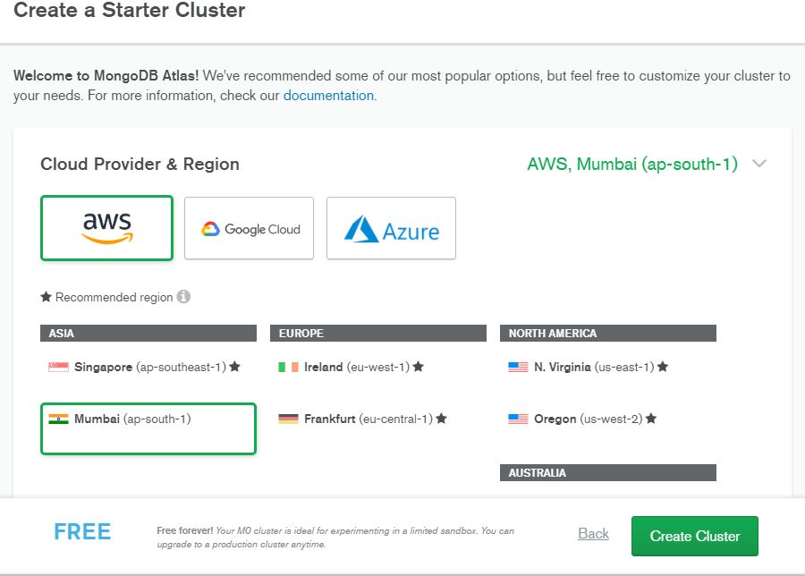
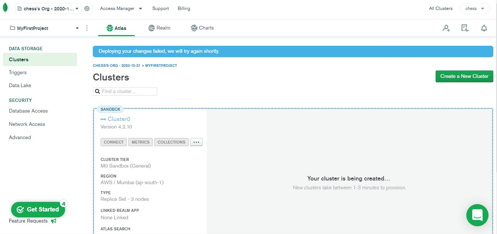
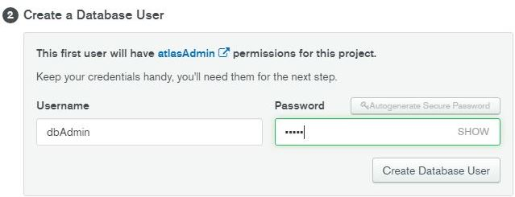
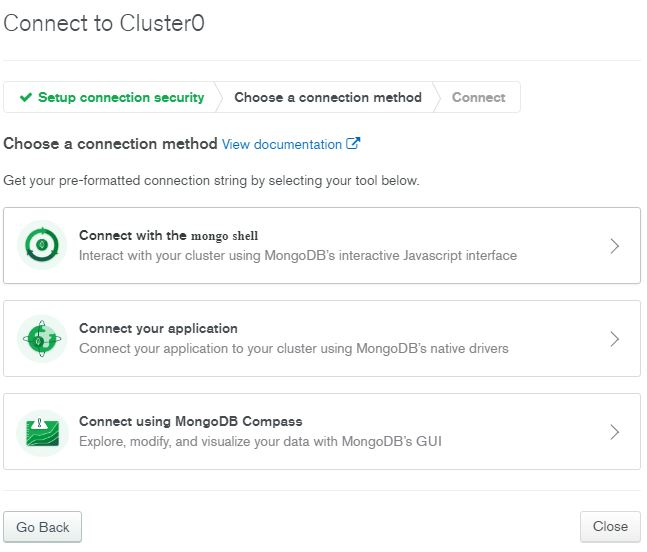

## What is MongoDb ##
Doing this microbyte means that you are somewhat familiar with database and tradition relational database management systems, most of which uses SQL as a language to manage the database. But probably you are not much familiar with noSQL database. Yes they exist and have established themselves as worthy solutions to database management these days. Some say "noSQL" stands for "non SQL" while others say it stands for "not only SQL". Either way, noSQL databases are databases that store data in formats **other** than relational tables. Formats may vary from documents to key-value to graph. MongoDB is such a nonSQL DBMS solution. It is document-oriented and uses JSON like documents to store data with optional schemas.

<details>
    <summary>Curious cat:</summary>

    1. Does it mean that noSQL or non relational databases don't store relationship data well?
    2. Well, what is optional schema? Till now we have only heard of fixed schema in RDBMS.

    You may give it a try to find answer to these questions. Anyway we will discuss it in later section.
</details>

## Running MongoDB ##
What does it mean by running MongoDB? See MongoDB is a DBMS and DBMS is nothing but a software application. So before starting to use MongoDB we have to run the application first. There are basically two ways of running/using the MongoDB server application. You can either run it locally or remotely.

**Steps to run it locally**
1. Head over to the [official download page](https://www.mongodb.com/try/download/enterprise) and download the binaries according to your operating system of choice. Recomended to download the stable version.
2. Extract the archive(wherever you want).
3. For Windows users add the address of bin folder to your system variables' path variable. For MAC and Linux the procedure will be similar.  
4. Once installed run ```mongod``` in your command prompt or terminal. This will setup and run the MongoDB server application on your local machine (The default port is 27017).
5. On a different terminal run the command ```mongo``` to run mongo shell. If your MongoDB server is up and running, your mongo shell will automatically connect with it. 

**Steps to run remotely**
1. Head over to [this link](https://account.mongodb.com/account/login) and create your account with an email id and password.

2. After creating your account you will see the below screen.


You can leave them as default or skip it for now. However they are important when you are developing production level software for an enterprise.

3. Next you will be prompted the screen below. Select **Create a cluster** with the FREE option.


4. Subsequently select AWS as the cloud provider, region as Mumbai(ap-south-1) and cluster tier as M0 Sandbox. Select **Create Cluster**.



5. You will be redirected to the clusters page. It takes around two minutes to create your cluster and deploy it.



6. Once your cluster is up and running you need to connect an end user to your cluster. So click on **Connect**. But before connecting you have to configure firewall settings and create an admin user. Select **Allow Access from Anywhere** in the whitelisting section.


Create a database admin user by providing a username and password. You may provide any username and password.



7. Once you are done with whitelisting and creating admin user you will be allowed to choose a connection method. Click on **Choose a connection method**.


Select **Connect with mongo shell**. 



If you do not have mongo shell installed in your system then select **I do not have mongo shell installed** and install mongo shell first, else you can select **I have the mongo shell installed** and select your mongo shell version. Copy the connection string provided to connect to your mongo cluster.


8. In your command line terminal paste the string you copied in the previous step. This will run mongo shell and also connect it to your mongo cluster.

With this you are all setup to use mongoDB as a database. 

## MongoDB clients and drivers ##
MongoDB clients are nothing but applications that are connected with the mongoDB database which manages data in the database. It can be any application like a java application, or a python application or even the mongo shell. However drivers are language specific libraries that are put forward by the developer community to help you easily connect your application to MongoDB database. MongoDB has a [number of official drivers](https://docs.mongodb.com/drivers/) for various languages.

