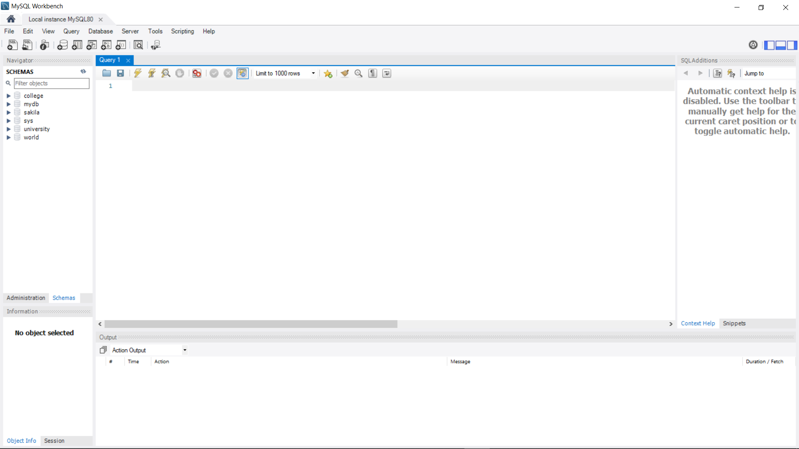
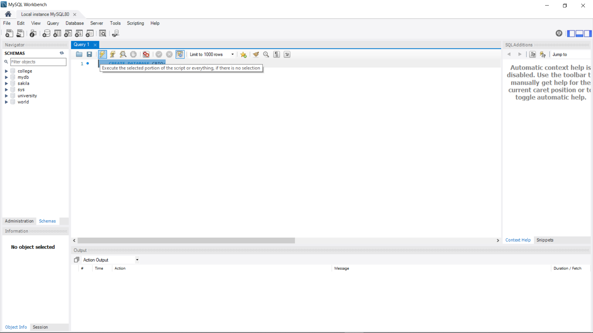

#Introduction

MySQL, the most popular Open Source SQL database management system, is developed, distributed, and supported by Oracle Corporation.
>A database is a structured collection of data. It may be anything from a simple shopping list to a picture gallery or the vast amounts of information in a corporate network
The SQL part of “MySQL” stands for “Structured Query Language”. SQL is the most common standardized language used to access databases
Table is a collection of data, organized in terms of rows and columns. In DBMS term, table is known as relation and row as tuple.

#Prerequisites

You'll need a SQL editor installed in your system for this activity. **No prior background knowledge** of SQL is required, just follow the Activities you will understand everything.

## Activities

### Activity 1: Choose a SQL editor

**You'll first need a SQl editor to before you begin this module. There are a lot of options to choose from including:**

1. `MySQL Workbench`
2. `Beekeeper Studio`
3. `HeidiSQL`
4. `SQuirreL SQL`
5. `Oracle SQL Developer`

And many more editors, you can check editors list from [here](https://www.geckoandfly.com/34197/free-sql-editor/). All these editors are free and user friendly.I'll be using `MySQL Workbench` for this module.

### Activity 2: Open MySQL Workbench 

By default you will be seeing a blank window,something like the image below 👇 

  

### Activity 3: Create a Database 

The next step is to create a Database in the MySQL Workbench,to create a Database use the "Query".

Here word Query came, so you might be thinking what is Query?

>So,a query is really a question or request for data.

Use the following query to create Database:

` CREATE DATABAS_NAME;`

You have to give Database name, try giving CRIO as a Database name and remenber every query should end with semicolon(;)

After writing the query just select the query and then click on execution button just like in image bellow 👇

After execution of query you will be seeing row(s) affected in output window, something like this 👇 

Congratulations!!🎉 you have successfully executed your first Query in SQL, so thats how we will be writing and executing Queries in MySQL.

### Activity 4: Use Database
Now in this step we will use the Database that we just created.

To use the Database use the following Query:

`USE DatabaseName;`

You have to enter the Database name that you have given while creating Database.

### Activity 5: Create a Table with constraints

**So let us first understand what is constraints?**

-MySQL CONSTRAINTS are used to limit the type of data that can be inserted into a table. 

Now we will create a table using a following SQL Statement:

- Create Statement : 

systax: 

CREATE TABLE table_name (
    column1 datatype,
    column2 datatype,
    column3 datatype,
   ....
);
Now Try creating a table with the columns : id, full_name, Age, contact and address.

Now we will add constraints to the Table:

systax:

CREATE TABLE table_name (
    column1 datatype ContraintName,
    column2 datatype ConstraintName,
    column3 datatype ConstraintName,
   ....
);

Try giving following constraints:

- primary key
- not null
- Unique 
- Default

Every constraints has its own properties and you can give more contraints to your table.
You can learn more about constraints form [Here](https://www.w3resource.com/mysql/creating-table-advance/constraint.php#:~:text=MySQL%20CONSTRAINT%20is%20used%20to,be%20inserted%20into%20a%20table.) and create table using these constraints.

**Default constraint must be added in your Table and try to find out how it works**

### Activity 6: Describe the Table

After executing the create table query we need to check how our table looks for that we need to use the keyword DESC which means Describe, it will show us the table that we created.

Use following query:

`DESC table_name;

Here give the tabe name that you have given while creating the table.

Congratulations!!🎉 Our Table is created Successfully and now you can see table with the constraints. 

### Activity 7: Insert values into the Table

Now we will insert values into the Table.

To insert values into the Table we will use INSERT INTO Statement, it will insert values

**NOTE**sql is not case sesitive language.

syntax:

INSERT INTO table_name (column1, column2, column3, ...)
VALUES (value1, value2, value3, ...);

In above Query in column1, column2... add your column names that you have created

If you have done everthing right then final output will come something like the image below 👇

 
 
 Congratulations🎉 we have successfully created a Table with constraints.
 
 ## SUMMARY
 
 We have created a Table, Inserted values in Table, Used Constraints in Table. Now you can easily create Table using SQL queries.
 
 ## REFERENCES
 
1. [w3resource](https://www.w3resource.com/index.php)
2. [w3schools.com](https://www.w3schools.com/default.asp)
3. [MySQLTUTORiAL](https://www.mysqltutorial.org/what-is-mysql/)
